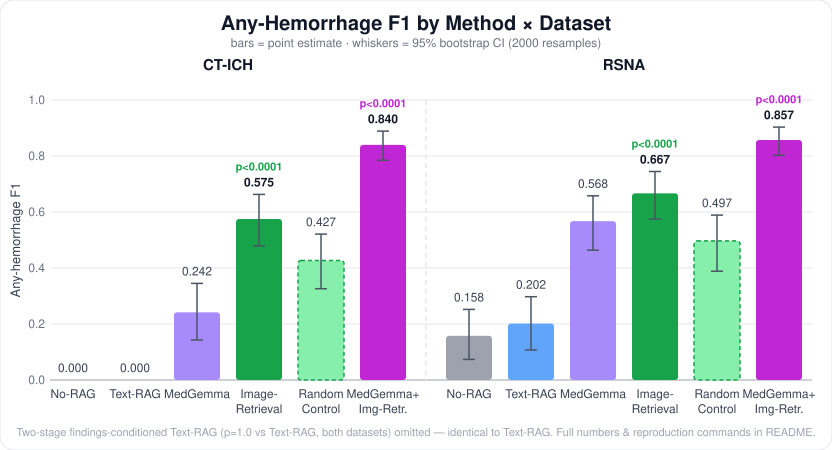
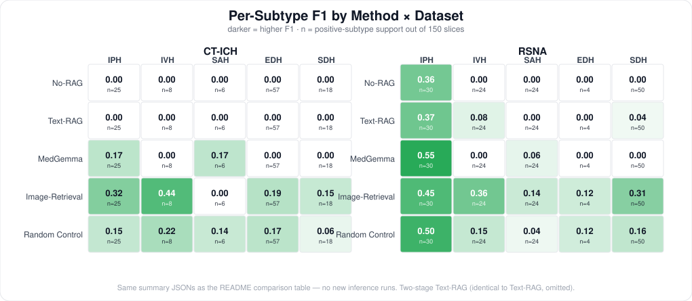

<div align="center">

# Medical vLM Microservice
### Can retrieval-augmented generation fix what a general VLM can't see on a head CT?

[](LICENSE)
[](https://www.python.org/)
[](https://fastapi.tiangolo.com/)
[](https://www.docker.com/)


[Results](#evaluation-results) · [Demo](#demo) · [Architecture](#architecture) · [Quick Start](#quick-start) · [Ethics](#ethics--data-compliance)

</div>

> [!IMPORTANT]
> **Research prototype, not a clinical tool.** Every number below comes from a controlled offline evaluation, not a deployed diagnostic product — see [Ethics & Data Compliance](#ethics--data-compliance).

## TL;DR

A 4B general-purpose vision-language model (Qwen3-VL) detects **zero** intracranial hemorrhages out of the box on head CT. We test two fixes — text knowledge, then visual examples — and measure which one actually works.

- 🔴 **Baseline floors on two independent datasets** — F1 = 0.000 (CT-ICH), F1 = 0.158 (RSNA). Not a fluke.
- 🟠 **Text-RAG (inject subtype descriptions) does nothing** — F1 unchanged. The model lacks *perception*, not *knowledge*.
- 🟢 **Image-retrieval RAG (few-shot visual exemplars) works, decisively** — F1 jumps to 0.575–0.667 (p<0.0001 vs. baseline on both datasets), and the gain survives a random-exemplar control.
- 🟣 **Domain pretraining and few-shot exemplars stack** — give MedGemma-4B (the domain-pretrained baseline) the *same* exemplars and F1 jumps further still, to 0.840–0.857 (p<0.0001 vs. both MedGemma zero-shot and Qwen3-VL+exemplars, both datasets). The two fixes aren't substitutes for each other.
- 🟤 **A "smarter" exemplar-selection design (2 similar + 1 hard negative) consistently underperforms plain similarity retrieval** — across both models and both datasets, it loses every time, always via lower recall, not lower precision. A cross-dataset exemplar pool turned out to be a large, real confound for plain similarity retrieval (rebuilding it from CT-ICH's own source data lifted MedGemma's CT-ICH F1 from 0.840 to 0.904) — but the same fix does *not* rescue the hard-negative design, so domain mismatch looks like at most a partial explanation for that design's underperformance, not the whole story.

> [!NOTE]
> **One-line takeaway**: the bottleneck was perceptual, not informational — verified four independent ways (a second dataset, a smarter retrieval query, a random-exemplar control, and a domain-pretrained model given the same exemplars) before trusting it. We also caught and corrected three of our own over-claims along the way — see *Honest limitations* below, including one made and corrected within this same round of experiments.

<p align="center"></p>

---

## Demo

Upload a head-CT slice → get a token-streamed (SSE) 4-section radiology report back, served from a containerized async FastAPI backend.

```bash
curl -X POST http://127.0.0.1:8000/analyze/stream \
  -F "prompt=Please systematically evaluate this head CT slice for acute intracranial hemorrhage." \
  -F "image=@./data/ct_ich/images/<slice>.png"
```
> No head-CT image ships in this repo (CT-ICH requires a free PhysioNet DUA — see [Quick Start](#quick-start) §0).

Two opt-in, mutually-exclusive flags (`-F "image_retrieval=true"` / `-F "two_stage=true"`, both default off): the **image-retrieval** flag reproduces the winning method above inside the live service; the **two-stage** flag reproduces the text-RAG null result. Details: [Quick Start](#quick-start).

<details>
<summary>📹 <b>Media checklist</b> — what's captured vs. still needed (click to expand)</summary>

| Asset | Status | What it shows |
|---|---|---|
| F1 comparison chart | ✅ above | Headline result, all rows, with 95% CI |
| SSE streaming demo | ⬜ todo | `/analyze/stream` returning a report token-by-token, ending on `[DONE]` |
| Image-retrieval mode | ⬜ todo | `/analyze` with `image_retrieval=true`, showing the constrained judgment + the gate refusing a non-head-CT input |
| Container boot | ⬜ todo | `docker build` → `docker run` → first request |

</details>

<details id="architecture">
<summary><b>Architecture</b> (click to expand)</summary>

1. **Ingress (`FastAPI`)** — `/analyze` (single response) or `/analyze/stream` (SSE) accept a multipart image + prompt.
2. **Backend dispatch (`config.py` + `inference.py`)** — `test` → OpenRouter (cloud API, local-dev only, never feeds the results below); `demo` → HF Transformers, in-process on the GPU, same load/generate code path as the offline eval pipeline. *(Used to proxy to a local Ollama server; Ollama was retired 2026-06-21 after an upstream CUDA bug, and `demo` now calls the model directly.)*
3. **Constrained report structure** — 4-section radiology output (`Quality → Findings → Impression → Recommendations`) plus a modality gate that declines, in plain language, on non-head-CT input.
4. **Two opt-in retrieval modes** — `two_stage` (text-RAG, a *null* result; inherits the report endpoint's modality gate, since it reuses the same system prompt) and `image_retrieval` (the method that actually moves F1; uses its own constrained prompt with no built-in gate, so a separate lightweight modality pre-check runs before it — see Honest limitations for that gate's measured accuracy).
5. **Offline evaluation track (`python/eval/`)** — separate from the service. Batch inference → rule-based parser → scored against ground truth. **The only source of every number in this README.**

**Why two tracks?** The service prompt is tuned for a readable report and a safe refusal; the eval prompt is tuned for parseable, reproducible labels. Mixing them would make every F1 depend on a prompt that's also being tuned for UX.

</details>

---

## Evaluation Results

Controlled, reproducible protocol across two independent head-CT hemorrhage datasets — [CT-ICH](https://physionet.org/content/ct-ich/1.3.1/) (75-patient cohort) and [RSNA ICH](https://www.kaggle.com/c/rsna-intracranial-hemorrhage-detection) (multi-institutional). 150 slices/dataset, multi-label stratified sampling (true subtype prevalence and co-occurrence preserved, not artificially balanced). Within each dataset, every row shares the same manifest, prompt, and scoring code — only the model or retrieval context changes.

**The claim that survives every control we ran, including against ourselves**: same model, same dataset, same eval images — only the context provider changes. Image-retrieval beats No-RAG and Text-RAG decisively on both datasets (p<0.0001, all four comparisons), **and** genuine visual retrieval beats a random-exemplar control once the query/pool visual domain is matched (+0.148 to +0.170 F1, p≤0.001). This holds purely *within* each dataset — it doesn't depend on ranking CT-ICH against RSNA, or on comparing against MedGemma, both of which turned out to be unfair comparisons on closer inspection (see *Honest limitations*).

<details>
<summary><b>Full numbers</b> — precision/recall, CI, missed-hemorrhage counts (click to expand)</summary>

| Dataset | Method | n | F1 | 95% CI | Precision | Recall | Missed entirely |
|---|---|---|---|---|---|---|---|
| CT-ICH | No-RAG (Qwen3-VL-4B) | 150 | 0.000 | [0.000, 0.000] | 0.000 | 0.000 | 100.0% (105/105) |
| CT-ICH | Text-RAG | 150 | 0.000 | [0.000, 0.000] | 0.000 | 0.000 | 100.0% (105/105) |
| CT-ICH | Text-RAG (two-stage) | 150 | 0.000 | [0.000, 0.000] | 0.000 | 0.000 | 100.0% (105/105) |
| CT-ICH | MedGemma-4B | 150 | 0.242 | [0.143, 0.345] | 0.789 | 0.143 | 85.7% (90/105) |
| CT-ICH | Image-Retrieval (R2-B) | 150 | **0.575** | [0.479, 0.663] | 0.836 | 0.438 | 56.2% (59/105) |
| CT-ICH | Image-Retrieval (random-exemplar control) | 150 | 0.427 | [0.326, 0.521] | 0.711 | 0.305 | 69.5% (73/105) |
| CT-ICH | MedGemma-4B + Image-Retrieval (k=3) | 150 | **0.840** | [0.785, 0.889] | 0.832 | 0.848 | 15.2% (16/105) |
| CT-ICH | MedGemma-4B + Image-Retrieval (random) | 150 | 0.762 | [0.695, 0.826] | 0.794 | 0.733 | 26.7% (28/105) |
| CT-ICH | MedGemma-4B + Image-Retrieval (contrastive) | 150 | 0.804 | [0.738, 0.860] | 0.828 | 0.781 | 21.9% (23/105) |
| CT-ICH | Image-Retrieval (contrastive) | 150 | 0.348 | [0.244, 0.446] | 0.727 | 0.229 | 77.1% (81/105) |
| RSNA | No-RAG (Qwen3-VL-4B) | 150 | 0.158 | [0.073, 0.252] | 1.000 | 0.086 | 91.4% (96/105) |
| RSNA | Text-RAG | 150 | 0.202 | [0.107, 0.298] | 0.857 | 0.114 | 88.6% (93/105) |
| RSNA | Text-RAG (two-stage) | 150 | 0.202 | [0.108, 0.300] | 0.857 | 0.114 | 88.6% (93/105) |
| RSNA | MedGemma-4B | 150 | 0.568 | [0.464, 0.658] | 0.977 | 0.400 | 60.0% (63/105) |
| RSNA | Image-Retrieval (R2-C) † | 150 | **0.667** | [0.575, 0.745] | 0.917 | 0.524 | 47.6% (50/105) |
| RSNA | Image-Retrieval (random-exemplar control) | 150 | 0.497 | [0.388, 0.591] | 0.841 | 0.352 | 64.8% (68/105) |
| RSNA | MedGemma-4B + Image-Retrieval (k=3) | 150 | **0.857** | [0.802, 0.903] | 0.857 | 0.857 | 14.3% (15/105) |
| RSNA | MedGemma-4B + Image-Retrieval (random) | 150 | 0.774 | [0.704, 0.836] | 0.819 | 0.733 | 26.7% (28/105) |
| RSNA | MedGemma-4B + Image-Retrieval (contrastive) | 150 | 0.800 | [0.734, 0.856] | 0.820 | 0.781 | 21.9% (23/105) |
| RSNA | Image-Retrieval (contrastive) | 150 | 0.575 | [0.471, 0.663] | 0.917 | 0.419 | 58.1% (61/105) |

*CI = 95% bootstrap percentile interval (2000 resamples). † **R2-C is the best point of a 4-point resolution sweep, not a single pre-registered setting** — see Honest limitations for the full sweep and why we still report it as primary.*

Image-Retrieval gives the same general model 3 visually-similar reference slices with known labels instead of text, retrieved from a study-disjoint RSNA pool (verified zero patient/study overlap by construction, `python/rag/build_rsna_pool.py`). **R2-C** = RSNA pool → RSNA eval. **R2-B** = RSNA pool → CT-ICH eval (pool histogram-matched to CT-ICH first, `python/rag/harmonize_pool.py`).

<p align="center"></p>

Reading the heatmap: Image-Retrieval is the only method that gets every subtype off zero on both datasets (SAH on CT-ICH is the exception, support=6 — too few positives to trust any score). No-RAG and Text-RAG are blank (F1=0.000) on every subtype except RSNA's IPH, which is the one subtype both datasets' co-occurrence-heavy positives keep landing on by chance, not a sign either method "works" on it.

</details>

<details>
<summary><b>Reproduce any row</b> (click to expand)</summary>

```bash
HF_HOME=/mnt/hf MODEL_ROLE=main      python python/eval/run_baseline.py --out results.jsonl              # No-RAG
HF_HOME=/mnt/hf MODEL_ROLE=main      python python/eval/run_baseline.py --context text --out results.jsonl  # Text-RAG
HF_HOME=/mnt/hf MODEL_ROLE=main      python python/eval/run_baseline.py --context text-twostage --out results.jsonl  # Text-RAG two-stage
HF_HOME=/mnt/hf MODEL_ROLE=medical_baseline python python/eval/run_baseline.py --out results.jsonl          # MedGemma-4B
HF_HOME=/mnt/hf MODEL_ROLE=main      python python/eval/run_baseline.py --manifest data/rsna/manifest.csv --images data/rsna/images \
  --context image --image-index-dir data/rag/image_index_c_128matched --image-pool-dir data/rsna/pool_images_128 \
  --out results.jsonl                                                                                     # Image-Retrieval R2-C (RSNA, resolution-matched)
HF_HOME=/mnt/hf MODEL_ROLE=main      python python/eval/run_baseline.py --manifest data/ct_ich/manifest.csv --images data/ct_ich/images \
  --context image --image-index-dir data/rag/image_index_b_harmonized --image-pool-dir data/rsna/pool_images_harmonized \
  --out results.jsonl                                                                                     # Image-Retrieval R2-B (CT-ICH)
# add --image-random to either command to reproduce the random-exemplar control
python python/eval/score_baseline.py --results results.jsonl
python python/eval/compare_runs.py   # regenerate the full comparison table from all summaries

# every paired-bootstrap p-value quoted above/below is reproducible from one command, e.g.:
python python/eval/significance_report.py --manifest data/rsna/manifest.csv \
  --a data/rsna/results_rag.jsonl --label-a "Text-RAG (R1)" \
  --b data/rsna/results_rag_twostage.jsonl --label-b "Text-RAG two-stage"
python python/eval/significance_report.py --self-test   # offline sanity check, no GPU needed
```

</details>

<details>
<summary><b>Honest limitations</b> — including three places we over-claimed and corrected ourselves (click to expand, recommended)</summary>

- **General-purpose VLMs floor out at this task, on both datasets.** A general vision-language model with no domain pretraining (Qwen3-VL-4B) detects essentially zero hemorrhages on CT-ICH (F1=0.000) and barely more on RSNA (F1=0.158, recall=0.086) — not a tuning failure, but a perceptual ceiling: it cannot reliably see what it was never trained to recognize.
- **Domain pretraining helps, unevenly — and the size of the help is dataset-dependent.** MedGemma-4B scores F1=0.242 on CT-ICH but F1=0.568 on RSNA, with non-overlapping confidence intervals — the *same model, same prompt* performs very differently depending on which dataset it's looking at. We do not have a confirmed explanation for this gap; three candidate factors are plausible and not mutually exclusive: (1) RSNA's higher co-occurrence rate gives the binary "any hemorrhage" metric more chances to be right via any one of several simultaneous findings; (2) the two datasets' source images differ in lesion severity and/or windowing/post-processing pipeline — a controlled test (same 150 RSNA images, only swapping a 128px source for a 512px one) found the *higher-resolution* source scored *worse* (F1=0.331 vs 0.568), with a directly visible loss of hyperdensity contrast on the same case across the two sources, pointing at windowing rather than resolution as the operative variable; (3) RSNA is one of the most widely discussed public medical-imaging benchmarks since 2019 and we cannot rule out the model's pretraining corpus having had some exposure to it, versus the far more obscure, access-gated CT-ICH. We report all three candidates rather than picking one — the uncertainty itself is the honest finding.
- **Text knowledge cannot substitute for visual training.** Injecting textbook descriptions of each hemorrhage subtype (retrieval-augmented generation) left the floor-level result unchanged on CT-ICH (F1=0.000 either way) and within the same confidence interval as no-RAG on RSNA (0.202 vs 0.158, CIs overlap). The gap is perceptual, not a missing-knowledge problem — which is why a text-knowledge fix doesn't move it.
- **A smarter retrieval query doesn't change that conclusion either.** Text-RAG's fixed query (`DEFAULT_QUERY`, retrieving the whole 5-document KB) could be dismissed as "too naive a query" rather than evidence that text knowledge itself can't help. We tested that alternative explanation directly: a two-stage variant has the model describe its own findings first, then retrieves only the top-2 KB entries conditioned on that description, before answering. Result: statistically indistinguishable from the original fixed-query Text-RAG on both datasets (paired-bootstrap diff=0.000, p=1.0 on CT-ICH and RSNA alike — 147–148/150 predictions were literally identical to Text-RAG's). This rules out "the query was too naive" as the reason text retrieval doesn't fix the perception gap.
- **...but visual examples can, on both datasets, by a wide margin.** Swapping the retrieval content from text descriptions to a handful of visually-similar reference images with known labels recovers nearly all of the No-RAG/Text-RAG gap on RSNA (R2-C: F1=0.667) and CT-ICH (R2-B: F1=0.575) — both p<0.0001 against their own dataset's No-RAG and Text-RAG rows. The bottleneck is genuinely perceptual, not informational: visual examples fix what describing the same content in words could not.
- **We closed the "untested" gap above: domain pretraining and few-shot exemplars turned out to be complementary, not substitutes.** An earlier version of this section said giving MedGemma the same 3 exemplars was "untested, left as an open question" — we ran it (full 150-image runs, both datasets, k=3, identical pools to the Qwen3-VL rows). Result: MedGemma-4B + Image-Retrieval reaches F1=0.840 (CT-ICH) and F1=0.857 (RSNA), beating *both* MedGemma zero-shot (+0.598 / +0.290 F1, p<0.0001 both datasets) *and* Qwen3-VL + the same exemplars (+0.265 / +0.191 F1, p<0.0001 both datasets) by wide, decisive margins. So this is not "a general model beats a specialist" (it never was), and it's also not "few-shot exemplars are a substitute for domain pretraining" — the two stack. Getting this number required a g4dn.xlarge → g6.xlarge GPU upgrade (T4 16GB → L4 24GB): MedGemma's vision tower OOMs on 3 exemplars + 1 query image at bf16 on a 16GB T4 regardless of quantization (4-bit/8-bit quantize the LLM decoder's linear layers, not the vision tower, so they didn't free the memory that was actually the bottleneck) — a real, separate finding about MedGemma's per-image vision-tower memory cost, not just an inconvenience. Separately, R2-B's and R2-C's point estimates should still not be ranked against each other — they're F1 on two *different* datasets (different 150 images each), and their 95% CIs overlap; cross-dataset ranking isn't meaningful here, the same reason No-RAG/MedGemma themselves swing by dataset (bullet above).
- **A "smarter" exemplar-selection design (contrastive ICL: 2 high-similarity + 1 hard negative) consistently underperforms plain top-k similarity retrieval — and we traced *why* with a 4-way ablation.** We tested it as an alternative to plain Image-Retrieval, hoping the hard negative (visually similar but opposite label) would teach sharper discrimination. Across all 4 (model × dataset) combinations it tried, it lost to plain retrieval every time (CT-ICH: MedGemma 0.804 vs 0.840, Qwen3-VL 0.348 vs 0.575; RSNA: MedGemma 0.800 vs 0.857, Qwen3-VL 0.575 vs 0.667) — and in every case the loss is concentrated in recall, not precision, i.e. the hard negative makes the model more hesitant to call a positive rather than better at telling subtypes apart. To find the mechanism we ran four follow-up ablations: **(1) hardness** — a zero-cost BiomedCLIP check confirmed the negatives are genuinely hard (positive-vs-negative similarity gap only ~0.03), so the selection isn't picking weak negatives; **(2) position** — moving the negative off the slot right before the query (it was always last) recovers much of the lost recall; **(3) count** — *removing the negative entirely* (3 positives, 0 negatives) recovers essentially all of it, landing back at plain top-k retrieval, while halving the example count (1 positive + 1 negative) makes recall worse still; **(4) softness** — swapping the hard negative for a *random* opposite-label image doesn't help and slightly hurts. Together these point — as the best current explanation, not a proven mechanism — at *the presence of a negative example itself* making the model more conservative about calling a positive, independent of how hard or where-placed that negative is. The "add a counter-example to teach discrimination" intuition simply doesn't hold for this task. **The sensitivity to exemplar composition is far larger for the general model than the domain-pretrained one**: across the six contrastive-family conditions, Qwen3-VL's recall swings by 0.39 on CT-ICH and 0.15 on RSNA, while MedGemma's swings by only 0.08 and 0.14 — readable as domain pretraining buying robustness to prompt/exemplar composition, not just raw accuracy (the general model leans harder on the in-context examples because it has no prior, so it's both more helped by good ones and more hurt by bad design). We initially concluded from CT-ICH alone that the effect was "model-specific (MedGemma unaffected)"; running the same ablations on RSNA overturned that — MedGemma *does* move there — so we corrected it to "present in both models, effect size differs," and flag the over-claim here rather than editing it away. (One loose end: contrastive doesn't even reliably beat the random-exemplar control — ahead on 3/4 combinations but behind on Qwen3-VL+CT-ICH, 0.348 vs 0.427 — which we still don't have a settled account of.)
- **k=3 (the exemplar count used everywhere above) does not look like a tuned optimum — performance looks saturated from k=1 on.** We swept k=1,2,4,5 for MedGemma+Image-Retrieval on both datasets; every resulting F1 sits inside the 95% CI of every other k (CT-ICH: 0.798–0.852 across k=1–5; RSNA: 0.820–0.857, non-monotonic with a dip at k=2). We can't distinguish any of these k values from each other with this sample size, so k=3 should be read as "a reasonable default that happened to get used everywhere," not as a result of tuning.
- **A cross-dataset exemplar pool looks like a real, substantial confound for plain similarity retrieval — but it does not explain the contrastive-ICL result above, so it's at most a partial account of the CT-ICH/RSNA gap.** Every CT-ICH Image-Retrieval number above retrieves from a *cross-dataset* RSNA pool (histogram-matched, not literally CT-ICH images) — there's no patient-disjoint, hemorrhage-positive CT-ICH-only pool available (the 28 CT-ICH patients never used in the 150-image eval manifest have only 5 hemorrhage slices between them, with zero EDH/IVH/SDH representation — unusable as a retrieval pool on their own). We built an alternative pool instead, sourced from slices of the *same* 47 patients already in the eval manifest that the manifest didn't happen to sample (`python/rag/build_ct_ich_pool.py`) — a disclosed, softer leakage risk (pool and eval can share a patient at a different slice/anatomical level) than the patient-disjoint guarantee the RSNA pool has. Swapping to this CT-ICH-native pool moved MedGemma+Image-Retrieval from 0.840 to 0.904 (dangerous false-negatives 16→2) and Qwen3-VL+Image-Retrieval from 0.575 to 0.705 (59→43) — both sizeable jumps consistent with cross-dataset retrieval being a real drag on plain similarity retrieval specifically. But the *same* pool swap left both Contrastive-ICL numbers flat or slightly worse (MedGemma 0.804→0.800, Qwen3-VL 0.348→0.326) — so whatever's wrong with the hard-negative design is not fixed by domain-matching the pool, ruling that out as the (or at least the sole) explanation for the contrastive results above. We also can't fully separate "genuine domain-matching benefit" from "the disclosed same-patient leakage made retrieval artificially easy" in the native-pool numbers — both plausibly contribute, and we don't have a way to isolate them with the data on hand.
- **We initially over-claimed a "perceptual ceiling" from this same round of experiments, and the very next experiment overturned it — recorded here as the correction, not edited away.** Looking only at the 6-way ablation above (random/high-sim/contrastive × CT-ICH/RSNA), 8 CT-ICH images came back as false negatives in *every single condition*, all of them EDH or SDH (extra-axial bleeds) — which we initially read as evidence of a hard perceptual limit no exemplar strategy tested could cross. Building the CT-ICH-native pool (previous bullet) and re-running MedGemma+Image-Retrieval against it overturned that: all 8 of those "unanimous failure" images were correctly caught (7/8 with the exact right subtype). So what looked like an intrinsic ceiling was, at least for this set of images, a retrieval-domain artifact — not evidence the model can't perceive these subtypes at all. We're stating this plainly rather than quietly fixing the earlier framing, because the failure mode (declaring a mechanism settled after one more round of experiments than the previous, now-overturned round) is the more important thing to flag than which specific claim was right.
- **R2-C originally had an undisclosed resolution mismatch, and fixing it changed the result — but the mechanism is genuinely not what we first assumed.** The retrieval pool is the 512px original-resolution RSNA source (`vaillant/rsna-ich-png`); the first version of this experiment queried it with the 128px RSNA eval source (`guiferviz`) used throughout this project, an unintentional mismatch we didn't catch until auditing the experiment setup itself. Downscaling the pool to 128px raised F1 from 0.556 to 0.667 (p<0.0001), and a follow-up sweep (96/128/192/512px, all re-run end-to-end on the GPU) confirmed this is a real, reproducible pattern, not a one-off: pools at ≤128px score 0.617–0.667, pools at ≥192px score exactly 0.556 (192px and the original 512px landed on the *identical* F1), with a clear break somewhere between 128px and 192px. So the effect is real, but it is **not** "exactly matching the query's 128px resolution" — 96px (which doesn't match) scores statistically indistinguishably from 128px (p=0.12) and significantly above 512px (p=0.031). It's closer to "below some downscaling threshold" than "equal to the query." We were unable to explain *why* via the retrieval mechanism itself: a BiomedCLIP top-k same-subtype hit-rate sweep across the same resolution range came out essentially flat (0.54–0.59 throughout, no resolution dependence) — yet the *specific* images retrieved differ substantially by pool resolution (only ~54% top-3 overlap between the 512px- and 128px-embedded versions of the same pool). A random-exemplar control independently showed pool image resolution alone doesn't affect the VLM's classification when exemplar *identity* is held fixed (F1 was identical, 0.497, whether the same randomly-chosen images were served at 512px or 128px). Put together: resolution changes *which* images BiomedCLIP retrieves, and that changes the downstream result, but neither "retrieval gets more discriminating" nor "the VLM prefers a given file resolution" explains it on its own — the mechanism remains open.
- **Retrieval quality only shows a measurable edge over random exemplars once the domain is matched.** We compared real (similarity-retrieved) exemplars against a same-pool *random*-exemplar control (k=3 random images, not nearest-neighbor) to separate "the model benefits from seeing any few-shot example" (format demonstration) from "the model benefits from a *visually relevant* one." Under R2-C's original resolution mismatch, retrieved exemplars were *not* significantly better than random (+0.060 F1, p=0.163). Once resolution was matched, retrieval pulled significantly ahead of random (+0.170 F1, p<0.0001), and R2-B (already domain-matched via histogram matching) showed the same pattern (+0.148 F1, p=0.001). Even the random-exemplar control beats No-RAG/Text-RAG decisively on both datasets (p<0.0001) — so *some* exemplar, any exemplar, helps a lot; genuine retrieval adds a further, real increment on top, conditional on the visual domain being consistent (see the bullet above for why "domain matching" is more subtle than it sounds).
- **More domain-matching is not always better.** We also tried stacking intensity (histogram) harmonization on top of R2-C's resolution match, targeting RSNA eval's own aggregate intensity distribution (`python/rag/harmonize_pool.py --reference-images data/rsna/images`). That dropped F1 from 0.667 to 0.599 (diff -0.068, p=0.05 — right at the conventional significance boundary) instead of improving it further, though retrieval still beat its own random-exemplar control in this setting (+0.116 F1, p=0.002). Histogram matching trades off local contrast to chase a global distribution match, and a literature search earlier in this work already flagged it as the weakest of the harmonization techniques we reviewed (see `python/rag/retrieval_sentinel.py`'s docstring) — this result is consistent with that limitation rather than a fluke. We report the resolution-only-matched number (0.667) as R2-C's primary result, not the further-harmonized one.
- **Small n on both datasets.** 150 slices per dataset; the bootstrap CIs above are the honest expression of how much that limits precision of the point estimates, especially for rarer subtypes.
- **Rule-based answer parsing, not a learned clinical labeler.** Free-text model output is parsed with a constrained-format-first, keyword-fallback parser (`python/eval/parse_answer.py`); parse-failure and refusal rates are reported as first-class metrics precisely so a low score can't be hand-waved away as "the parser didn't understand it" (both rates are 0% across all rows above). The parser's keyword/regex rules have been spot-checked against raw model text but not yet scored against an independent human-labeled sample — an open item, not yet done.
- **The image-retrieval demo path's modality gate is decoupled from the measured eval configuration, and has a measured, non-zero false-refusal rate.** `image_retrieval=true` runs a separate, minimal yes/no generate before the constrained few-shot judgment that was actually measured (0.575/0.667 F1) — so the substantive judgment itself stays identical to what was scored, while a non-head-CT image gets declined. Validated on the full 150-image CT-ICH manifest plus the 22-image defensive set (`python/scripts/validate_r2_gate.py`, 2026-06-24): the defensive set is 0/22 false passes (every non-head-CT image correctly declined) across all three prompt iterations below, but CT-ICH false refusals only fell from 13/150 (8.7%) → 7/150 (4.7%) → 4/150 (2.7%) as the gate prompt was tightened — it did not reach zero. The 4 remaining false refusals (`055_017.png`, `078_002.png`, `085_006.png`, `087_001.png`) are all the very first or last slice in their patient's scan range — boundary slices near the skull vertex or base showing little brain tissue, a real, identified edge case, not random noise. We stopped iterating at 3 prompt rounds rather than keep tuning against this exact validation set (which would risk overfitting to these specific images rather than generalizing); the residual 2.7% false-refusal rate is reported here rather than hidden.

</details>

---

## Ethics & Data Compliance

- **Research prototype, not a clinical decision-support tool.** No output should inform or substitute for an actual diagnosis or treatment decision; every AI-generated report carries an explicit disclaimer to this effect.
- **Dataset licenses are respected; no licensed image bytes or labels are redistributed.** [CT-ICH](https://physionet.org/content/ct-ich/1.3.1/) is CC-BY 4.0 via PhysioNet (requires a Data Use Agreement); this repo commits its derived manifest (image IDs + the 6-D labels used for scoring), which CC-BY permits. **[RSNA ICH](https://www.kaggle.com/c/rsna-intracranial-hemorrhage-detection) is different and stricter**: its competition rules state "*Re-distribution or re-identification of any data is strictly prohibited*" and that participants agree "*not to make copies of, or in any way redistribute, any of the data*" (§7.A/§7.B) — language broad enough to cover derived labels, not just pixels. An earlier version of this repo committed `data/rsna/manifest.csv` and `data/rsna/pool_manifest.csv` (RSNA image IDs + derived hemorrhage labels) in violation of that clause; **these have been purged from git history** (`.gitignore`d going forward, see commit log around 2026-06-25) and must instead be regenerated locally — `python python/eval/prep_rsna.py` / `python/rag/build_rsna_pool.py` — by anyone who has accepted the competition rules under their own Kaggle account. Raw pixels for both datasets are likewise `.gitignore`d and must be fetched locally under each dataset's own agreement.
- **2D, single-slice, single-modality.** Evaluation is per-slice, not on the full 3D volume a radiologist would review, and not validated against any other modality — a known simplification (see *Honest limitations*).
- **Two datasets reduce, but don't eliminate, external-validity risk.** Cross-dataset evaluation surfaced a real, only partially-understood gap between CT-ICH and RSNA (see *Honest limitations*) — a reminder that even two datasets isn't full generalization proof.
- **Answer parsing is rule-based**, with its own failure/refusal rate reported as a first-class metric rather than assumed reliable.

---

<details id="quick-start">
<summary><b>Quick Start</b> (click to expand)</summary>

### 0. Dataset access (required before any evaluation run)
- **CT-ICH**: sign PhysioNet's DUA, download v1.3.1 from [physionet.org/content/ct-ich/1.3.1](https://physionet.org/content/ct-ich/1.3.1/), then `python python/eval/prep_ct_ich.py`.
- **RSNA**: accept the competition rules on [Kaggle](https://www.kaggle.com/c/rsna-intracranial-hemorrhage-detection), then `python python/eval/prep_rsna.py`.

### 1. Environment Configuration

```ini
ENV=test                 # test | dev | demo
MODEL_ROLE=main          # main | medical_baseline

OPENROUTER_API_URL=https://openrouter.ai/api/v1/chat/completions
OPENROUTER_API_KEY=[your_key]
# demo/dev both run HF + Transformers in-process; HF_MAIN_MODEL/HF_MEDICAL_MODEL override defaults
```

> Backends split by *purpose*, not engine: `dev` (`run_baseline.py`) produces every reported metric; `demo`/`test` are the served API and never feed the comparison table.

### 2. Sandbox Deployment (Docker)

```bash
git clone https://github.com/your-username/med-vlm-service.git
cd med-vlm-service
docker build --no-cache -t med-vlm-sandbox .
docker run -d -p 8000:8000 --env-file .env --name medical_service_agent med-vlm-sandbox
```

### 3. Inference Verification

```bash
curl -X POST http://127.0.0.1:8000/analyze \
  -F "prompt=Please systematically evaluate this head CT slice for acute intracranial hemorrhage." \
  -F "image=@./data/ct_ich/images/<slice>.png"
```

Opt-in flags (`TWO_STAGE_RAG`/`IMAGE_RETRIEVAL_RAG` env vars, both default off, mutually exclusive):
- `two_stage=true` — findings-conditioned text-RAG (a *null* result — see Evaluation Results — kept for architecture-completeness, not quality).
- `image_retrieval=true` — reproduces the winning R2-B config; declines non-head-CT input via its own modality gate (see Honest limitations) before running the constrained judgment.

</details>

<details>
<summary><b>Open-Source Stack</b> (click to expand)</summary>

- **[FastAPI](https://github.com/tiangolo/fastapi)** — async ASGI framework.
- **[HTTPX](https://github.com/encode/httpx)** — async client for the `test` environment's OpenRouter calls.
- **[Docker](https://github.com/docker)** — reproducible sandbox runs.
- **[OpenRouter](https://openrouter.ai/)** — cloud API for `test` only.
- **[Hugging Face Transformers](https://github.com/huggingface/transformers)** — in-process GPU inference, shared by `dev` and `demo`.
- **[BiomedCLIP](https://huggingface.co/microsoft/BiomedCLIP-PubMedBERT_256-vit_base_patch16_224)** — image-text encoder for R2's retrieval.
- **[ChromaDB](https://www.trychroma.com/)** — vector store for the text-RAG knowledge base.

</details>
