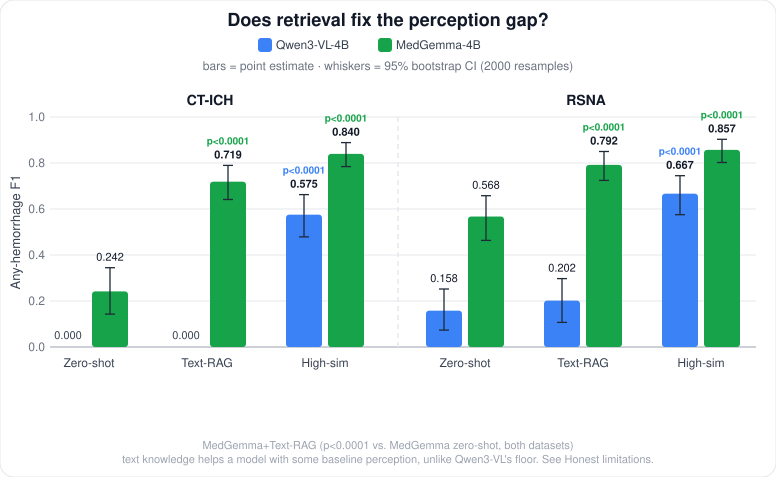
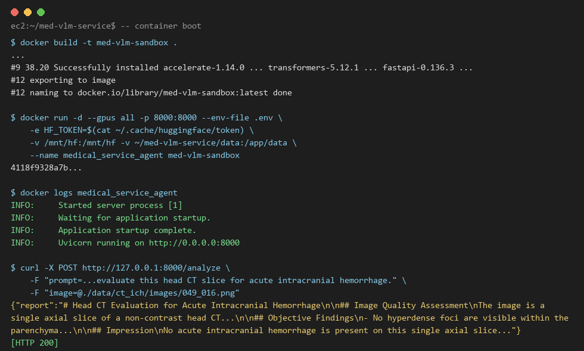
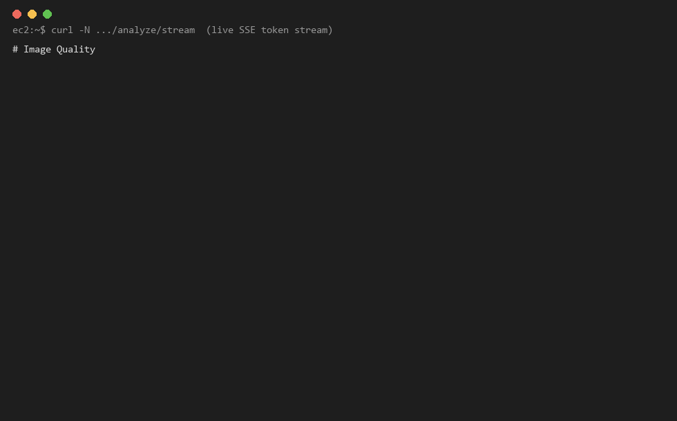
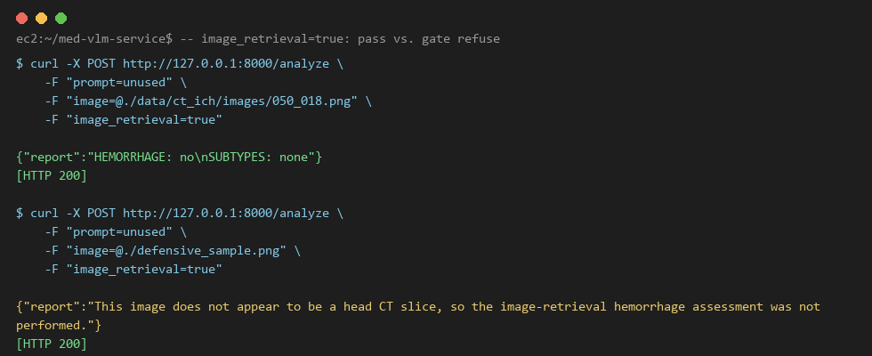
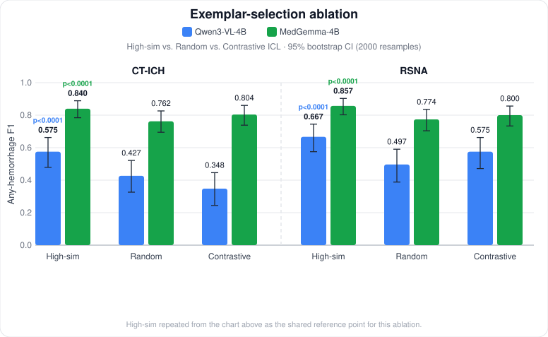

<div align="center">

# Medical VLM Microservice
### Can retrieval-augmented generation fix what a general VLM can't see on a head CT?

[](LICENSE)
[](https://www.python.org/)
[](https://fastapi.tiangolo.com/)
[](https://www.docker.com/)

[Results](#evaluation-results) · [Demo](#demo) · [Architecture](#architecture) · [Quick Start](#quick-start) · [Ethics](#ethics--data-compliance)

</div>

> **How this project was built.** I wrote some of the code here with Claude Opus 4.8 and Sonnet 4.6, but the research is mine: I picked the question, chose which methods to try, designed the controls, decided which results to trust, and left my wrong conclusions in place instead of deleting them. Read this as a lab notebook, not a paper.

> **Research prototype, not a clinical tool.** Every number below comes from an offline evaluation I ran myself. This is not a medical product. See [Ethics & Data Compliance](#ethics--data-compliance).

---

## Why did I make this project?

My long-term goal is markerless movement analysis. I want to measure how a patient moves from video, with no markers on the body. Then a specialist can review the result from another place.

Before this project, I read a study on remote gait assessment ([npj Digital Medicine, 2025](https://www.nature.com/articles/s41746-025-02211-y)). It tested 3D pose models on SCAI-Gait, a dataset of 225 people with spinal cord injury. The best model, VideoPose3D, had an error of 90.7 ± 33.6 mm on this group, but only 24.8 ± 30.2 mm on healthy people. The video settings mattered too: 78.1 ± 32.9 mm at 1920×1080 and 50 FPS, but 107.7 ± 25.1 mm at 720×576 and 25 FPS.

So a good benchmark score does not tell me what a model will see in real patients. But I could not test this on movement, because there is no labelled data I can test against for the patients I have in mind. If my method was wrong, nothing would tell me. Head CT has public datasets with labels, so I can check whether I am wrong. This project is that test.

Only the method transfers, not the numbers. A hemorrhage on a CT slice is not a joint angle, and I do not claim that any result here applies to pose estimation. I work the same way here. I always run a control, and I never trust a benchmark score by itself. I also report an effect even when I cannot explain it.

---

## What was I trying to find out?

Something simple bothered me at the start. A 4B general-purpose vision-language model (Qwen3-VL) can describe almost any everyday photo, but when I give it a head CT, it finds **zero** intracranial hemorrhages. That left one question worth answering: when the model can't see the bleed, is it missing *knowledge* or missing *perception*? I tried a fix for each, and measured which one actually moved the number.

Here's where I ended up, in the order I found it out:

- **The baseline is very low on both datasets, so it isn't an accident.** F1 = 0.000 (CT-ICH), F1 = 0.158 (RSNA).
- **Textbook knowledge in text form changed nothing for Qwen3-VL** (F1 0.000 → 0.000). Later I gave the same text to a different model, MedGemma, and there it helped a lot (0.242 → 0.719, 0.568 → 0.792). That surprised me enough that I ran it again. My reading now: text can't replace *zero* perception, but it can improve *partial* perception.
- **Visual examples worked much better than text.** F1 rises to 0.575 to 0.667 (p<0.0001 against the baseline on both datasets), and the result stayed strong in a random-example control.
- **Domain pretraining and visual examples work together, and neither replaces the other.** MedGemma-4B with the same examples reaches 0.840 to 0.857.
- **A "clever" idea I was sure would help made things worse.** The idea was to add a hard negative example, and it failed every time, on both models and both datasets. I ran four more experiments. The answer looks simple: the negative example itself made the model too cautious, and how hard the example was didn't matter. I was wrong here, and I've kept the wrong version in the notes below.

> **The main point**: the problem was perception, not knowledge. I didn't believe that until I'd tested it four different ways: a second dataset, a better retrieval query, a random-example control, and a domain-pretrained model given the same examples. I also overclaimed three times during this work, and I've marked those places in *Honest limitations* on purpose.

<p align="center"></p>

---

## Demo

Upload a head-CT slice and the service returns a 4-section radiology report, streamed token by token over SSE. The backend is an async FastAPI service running in a container.

```bash
curl -X POST http://127.0.0.1:8000/analyze/stream \
  -F "prompt=Please systematically evaluate this head CT slice for acute intracranial hemorrhage." \
  -F "image=@./data/ct_ich/images/<slice>.png"
```
> No head-CT images ship with this repo. CT-ICH requires a free PhysioNet DUA. See [Quick Start](#quick-start) §0.

Two optional flags exist, and only one can be used at a time (`-F "image_retrieval=true"` / `-F "two_stage=true"`); both are off by default. The image-retrieval flag runs the best method inside the live service. The two-stage flag runs the text-RAG method, which was a null result. See [Quick Start](#quick-start) for details.

<p align="center"></p>
<p align="center"></p>
<p align="center"></p>

*These come from a real EC2 run on 2026-06-26. The content is genuine `docker build`, `docker run` and `curl` output: I saved the text and rendered terminal-style images and a GIF from it, since I had no way to record the screen.*

<details id="architecture">
<summary><b>How the service is put together</b> (click to expand)</summary>

1. **Ingress (`FastAPI`).** `/analyze` (single response) and `/analyze/stream` (SSE) both accept a multipart image plus prompt.
2. **Backend dispatch (`config.py` + `inference.py`).** `test` routes to OpenRouter, a cloud API used for local development only, which never produces any of the results below. `demo` routes to HF Transformers on the GPU in the same process, sharing its load and generate code with the offline eval pipeline. *(`demo` used to call a local Ollama server; I dropped Ollama on 2026-06-21 over a CUDA bug and now call the model directly.)*
3. **Fixed report structure.** Four sections (`Quality → Findings → Impression → Recommendations`), plus a modality gate that refuses anything that isn't a head CT and explains the refusal in plain language.
4. **Two opt-in retrieval modes.** `two_stage` (text-RAG, a *null* result) and `image_retrieval` (the one that actually moves F1).
5. **Offline evaluation track (`python/eval/`).** Kept separate from the service: batch inference → rule-based parser → scored against ground truth. Every number in this README comes from here and nowhere else.

**Why two separate tracks.** The service prompt is tuned for a readable report and a safe refusal; the eval prompt is tuned for labels that parse cleanly and repeat. Mixing them would make every F1 score depend on a prompt I was also tweaking for user experience, and then I couldn't trust the numbers. The split is deliberate.

</details>

---

## Evaluation Results

The same protocol runs on two separate head-CT hemorrhage datasets: [CT-ICH](https://physionet.org/content/ct-ich/1.3.1/) (75 patients) and [RSNA ICH](https://www.kaggle.com/c/rsna-intracranial-hemorrhage-detection) (many hospitals), 150 slices from each. Sampling is multi-label stratified, so the real subtype rates and co-occurrence are preserved and nothing is hand-balanced. Within a dataset, every row shares the same manifest, the same prompt and the same scoring code; only the model or the retrieval context changes.

**This is the result I trust most, because it passed every test I gave it, including the ones designed to break it.** Model, dataset and eval images all stay fixed, and only the context provider changes. Image-retrieval beats No-RAG and Text-RAG on both datasets, p<0.0001 across all four comparisons. Real visual retrieval also beats a random-example control, but only when the query and the pool share a visual domain (+0.148 to +0.170 F1, p≤0.001). All of this holds *within* a dataset. I don't compare CT-ICH against RSNA, because that comparison turns out not to be fair (see *Honest limitations*).

<details>
<summary><b>Full numbers</b>: precision/recall, CI, missed-hemorrhage counts (click to expand)</summary>

| Dataset | Method | n | F1 | 95% CI | Precision | Recall | Missed entirely |
|---|---|---|---|---|---|---|---|
| CT-ICH | No-RAG (Qwen3-VL-4B) | 150 | 0.000 | [0.000, 0.000] | 0.000 | 0.000 | 100.0% (105/105) |
| CT-ICH | Text-RAG | 150 | 0.000 | [0.000, 0.000] | 0.000 | 0.000 | 100.0% (105/105) |
| CT-ICH | Text-RAG (two-stage) | 150 | 0.000 | [0.000, 0.000] | 0.000 | 0.000 | 100.0% (105/105) |
| CT-ICH | MedGemma-4B | 150 | 0.242 | [0.143, 0.345] | 0.789 | 0.143 | 85.7% (90/105) |
| CT-ICH | MedGemma-4B + Text-RAG | 150 | 0.719 | [0.641, 0.790] | 0.793 | 0.657 | 34.3% (36/105) |
| CT-ICH | Image-Retrieval (R2-B) | 150 | **0.575** | [0.479, 0.663] | 0.836 | 0.438 | 56.2% (59/105) |
| CT-ICH | Image-Retrieval (random-exemplar control) | 150 | 0.427 | [0.326, 0.521] | 0.711 | 0.305 | 69.5% (73/105) |
| CT-ICH | MedGemma-4B + Image-Retrieval (k=3) | 150 | **0.840** | [0.785, 0.889] | 0.832 | 0.848 | 15.2% (16/105) |
| CT-ICH | MedGemma-4B + Image-Retrieval (random) | 150 | 0.762 | [0.695, 0.826] | 0.794 | 0.733 | 26.7% (28/105) |
| CT-ICH | MedGemma-4B + Image-Retrieval (contrastive) | 150 | 0.804 | [0.738, 0.860] | 0.828 | 0.781 | 21.9% (23/105) |
| CT-ICH | Image-Retrieval (contrastive) | 150 | 0.348 | [0.244, 0.446] | 0.727 | 0.229 | 77.1% (81/105) |
| RSNA | No-RAG (Qwen3-VL-4B) | 150 | 0.158 | [0.073, 0.252] | 1.000 | 0.086 | 91.4% (96/105) |
| RSNA | Text-RAG | 150 | 0.202 | [0.107, 0.298] | 0.857 | 0.114 | 88.6% (93/105) |
| RSNA | Text-RAG (two-stage) | 150 | 0.202 | [0.108, 0.300] | 0.857 | 0.114 | 88.6% (93/105) |
| RSNA | MedGemma-4B | 150 | 0.568 | [0.464, 0.658] | 0.977 | 0.400 | 60.0% (63/105) |
| RSNA | MedGemma-4B + Text-RAG | 150 | 0.792 | [0.724, 0.850] | 0.874 | 0.724 | 27.6% (29/105) |
| RSNA | Image-Retrieval (R2-C) † | 150 | **0.667** | [0.575, 0.745] | 0.917 | 0.524 | 47.6% (50/105) |
| RSNA | Image-Retrieval (random-exemplar control) | 150 | 0.497 | [0.388, 0.591] | 0.841 | 0.352 | 64.8% (68/105) |
| RSNA | MedGemma-4B + Image-Retrieval (k=3) | 150 | **0.857** | [0.802, 0.903] | 0.857 | 0.857 | 14.3% (15/105) |
| RSNA | MedGemma-4B + Image-Retrieval (random) | 150 | 0.774 | [0.704, 0.836] | 0.819 | 0.733 | 26.7% (28/105) |
| RSNA | MedGemma-4B + Image-Retrieval (contrastive) | 150 | 0.800 | [0.734, 0.856] | 0.820 | 0.781 | 21.9% (23/105) |
| RSNA | Image-Retrieval (contrastive) | 150 | 0.575 | [0.471, 0.663] | 0.917 | 0.419 | 58.1% (61/105) |

*CI = 95% bootstrap percentile interval (2000 resamples). † **R2-C is the best result of a 4-point resolution sweep, not a setting I fixed in advance.** Honest limitations has the full sweep, and my reason for still reporting it as the headline number.*

Image-Retrieval hands the same general model 3 visually similar reference slices with known labels instead of text. Those slices come from an RSNA pool that shares no studies with the test set, and I verified there is no patient or study overlap (`python/rag/build_rsna_pool.py`). **R2-C** = RSNA pool → RSNA eval. **R2-B** = RSNA pool → CT-ICH eval. For R2-B, the pool is histogram-matched to CT-ICH first (`python/rag/harmonize_pool.py`).

<p align="center"></p>

<p align="center"></p>

Reading the heatmap: Image-Retrieval is the only method scoring above zero on every subtype in both datasets, with SAH on CT-ICH as the exception, and that cell has only 6 positives, too few to trust. No-RAG and Text-RAG score 0.000 on every subtype except IPH on RSNA. I think this happens by chance: both datasets carry many positives with several subtypes at once, so IPH is the easy one to hit. It doesn't mean those two methods work.

</details>

<details>
<summary><b>Reproduce any row</b> (click to expand)</summary>

```bash
HF_HOME=/mnt/hf MODEL_ROLE=main      python python/eval/run_baseline.py --out results.jsonl              # No-RAG
HF_HOME=/mnt/hf MODEL_ROLE=main      python python/eval/run_baseline.py --context text --out results.jsonl  # Text-RAG
HF_HOME=/mnt/hf MODEL_ROLE=main      python python/eval/run_baseline.py --context text-twostage --out results.jsonl  # Text-RAG two-stage
HF_HOME=/mnt/hf MODEL_ROLE=medical_baseline python python/eval/run_baseline.py --out results.jsonl          # MedGemma-4B
HF_HOME=/mnt/hf MODEL_ROLE=medical_baseline python python/eval/run_baseline.py --context text --out results.jsonl  # MedGemma-4B + Text-RAG
HF_HOME=/mnt/hf MODEL_ROLE=main      python python/eval/run_baseline.py --manifest data/rsna/manifest.csv --images data/rsna/images \
  --context image --image-index-dir data/rag/image_index_c_128matched --image-pool-dir data/rsna/pool_images_128 \
  --out results.jsonl                                                                                     # Image-Retrieval R2-C (RSNA, resolution-matched)
HF_HOME=/mnt/hf MODEL_ROLE=main      python python/eval/run_baseline.py --manifest data/ct_ich/manifest.csv --images data/ct_ich/images \
  --context image --image-index-dir data/rag/image_index_b_harmonized --image-pool-dir data/rsna/pool_images_harmonized \
  --out results.jsonl                                                                                     # Image-Retrieval R2-B (CT-ICH)
# add --image-random to either command to reproduce the random-exemplar control
python python/eval/score_baseline.py --results results.jsonl
python python/eval/compare_runs.py   # regenerate the full comparison table from all summaries

# every paired-bootstrap p-value quoted above/below is reproducible from one command, e.g.:
python python/eval/significance_report.py --manifest data/rsna/manifest.csv \
  --a data/rsna/results_rag.jsonl --label-a "Text-RAG (R1)" \
  --b data/rsna/results_rag_twostage.jsonl --label-b "Text-RAG two-stage"
python python/eval/significance_report.py --self-test   # offline sanity check, no GPU needed
```

</details>

<details>
<summary><b>Honest limitations</b>, including three places where I overclaimed and then corrected myself (click to expand, recommended)</summary>

If you're reviewing this, start here. The mistakes stayed in rather than getting cleaned out, because how I noticed I was wrong matters more than any single F1 score.

- **General VLMs score very low on this task, on both datasets.** With no domain pretraining, Qwen3-VL-4B finds almost no hemorrhages on CT-ICH (F1=0.000) and only a handful more on RSNA (F1=0.158, recall=0.086). That reads to me as a limit of perception rather than a tuning problem: the model can't see what it never learned to recognize.
- **Domain pretraining helps, but not equally on both datasets, and I don't fully know why.** MedGemma-4B scores F1=0.242 on CT-ICH and F1=0.568 on RSNA, with confidence intervals that don't overlap. The *same model with the same prompt* behaves very differently on each dataset, and I have no proven reason for it, only three guesses that could all be true at once. (1) RSNA has more images carrying several subtypes at once, so the yes/no "any hemorrhage" metric has more chances to be correct. (2) The two datasets may differ in lesion severity or in windowing. I tested that by holding the same 150 RSNA images fixed and changing only the source from 128px to 512px; the *higher-resolution* source scored *worse* (0.331 vs 0.568) and showed much less hyperdensity contrast, which points at windowing rather than resolution. (3) RSNA has been a well-known public benchmark since 2019, so a model may have seen part of it during pretraining, while CT-ICH is far less known and needs approved access. I'm listing all three instead of picking one, because I honestly don't know.
- **Text knowledge can't replace visual training when there's no visual training at all.** I added textbook descriptions of each subtype. On CT-ICH, Qwen3-VL didn't move (0.000 both times); on RSNA it stayed inside the no-RAG confidence interval (0.202 vs 0.158). For *this* model the bottleneck is perception, and a text fix doesn't touch it.
- **A better retrieval query didn't change this either.** I worried the fixed query was too simple, so I built a two-stage version: the model first describes its own findings, then pulls only the top-2 KB entries based on that description. The result matched the original within noise (diff=0.000, p=1.0 on both datasets), and on 147 or 148 of the 150 images the predictions were exactly the same. So "the query was too simple" isn't the explanation, at least not for Qwen3-VL.
- **This surprised me enough to test it twice: the same text that does nothing for Qwen3-VL helps MedGemma a lot.** I had *assumed*, without testing, that "text can't fix it" would carry over to MedGemma, since both run the same Text-RAG code. That was wrong. MedGemma-4B + Text-RAG reaches 0.719 (CT-ICH, +0.477, p<0.0001) and 0.792 (RSNA, +0.224, p<0.0001). It isn't just a "say yes more often" effect either: precision barely moves and recall does almost all the work. Because the result surprised me, I deleted the output and reran both datasets from the beginning. Generation is greedy and deterministic, so a second run can only catch run-time problems, not sampling noise, and both runs came back identical, 0/150 differences. My current view is this: text can't replace *zero* perception (Qwen3-VL), but it can improve *partial* perception, and MedGemma already scores clearly above zero without any examples. This was an assumption I'd borrowed from other people and never checked until I made myself check it.
- **...but visual examples do help, on both datasets, by a lot.** Swapping the retrieval content from text to a few visually similar labeled images closed most of the gap on RSNA (R2-C: 0.667) and on CT-ICH (R2-B: 0.575), both p<0.0001 against No-RAG and Text-RAG on the same dataset. So the problem really is perception: examples fixed what the same information in words could not.
- **I filled my own "untested" gap. Domain pretraining and few-shot examples stack, and they don't substitute for each other.** An earlier version of this section called giving MedGemma the same 3 examples "untested, left as an open question," so I ran it. MedGemma-4B + Image-Retrieval reaches 0.840 (CT-ICH) and 0.857 (RSNA), beating MedGemma with no examples (+0.598 / +0.290, p<0.0001) and Qwen3-VL with the same examples (+0.265 / +0.191, p<0.0001). So "a general model beats a specialist" was never true, and neither is "examples replace pretraining". The two effects add up. Getting this number meant upgrading the GPU from g4dn.xlarge to g6.xlarge (T4 16GB → L4 24GB), because MedGemma's vision tower runs out of memory with 3 examples plus 1 query at bf16 on a 16GB T4. Quantization didn't help: 4-bit and 8-bit shrink only the LLM decoder, not the vision tower, so they never freed the memory that was actually the problem. That's a real finding about the memory cost of MedGemma's vision tower, not just a problem I paid money to avoid.
- **A "smarter" example-selection design I believed in lost to plain top-k retrieval every time, and I found out why.** The design was contrastive ICL: 2 high-similarity examples plus 1 hard negative. I expected the hard negative (similar image, opposite label) to teach the model a sharper judgment. It lost in all 4 combinations of model and dataset (CT-ICH: MedGemma 0.804 vs 0.840, Qwen3-VL 0.348 vs 0.575; RSNA: MedGemma 0.800 vs 0.857, Qwen3-VL 0.575 vs 0.667), and every time the loss came out of recall, not precision, meaning the negative example made the model afraid to say "positive". I ran four more tests to find the cause. **(1) Hardness**: a BiomedCLIP check confirmed the negatives really are hard (similarity gap ~0.03), so I wasn't picking weak ones. **(2) Position**: moving the negative out of the slot just before the query brought much of the lost recall back. **(3) Count**: *removing the negative entirely* (3 positives, 0 negatives) brought back almost all of it. **(4) Softness**: swapping the hard negative for a *random* opposite-label image didn't help. My explanation isn't proven, but it's simple: any negative example makes the model more cautious, and neither its hardness nor its position matters much. So "add a counter-example to teach the difference" doesn't work here. The effect is much larger for the general model than for the domain-pretrained one, with Qwen3-VL recall shifting by 0.39 on CT-ICH against MedGemma's 0.08, which suggests domain pretraining also gives stability against prompt changes, not only accuracy. **I first ran this on CT-ICH only and concluded MedGemma was "unaffected". The same tests on RSNA showed that was wrong, so I corrected it to "present in both, but different in size", and I'm showing the mistake here instead of deleting it.** (One question I can't answer: contrastive doesn't clearly beat the random control either. It's ahead in 3 of 4 cases, but behind on Qwen3-VL + CT-ICH, 0.348 vs 0.427.)
- **k=3 is the example count I used everywhere, but it doesn't look like a tuned best value. The score is already flat from k=1.** I tested k=1, 2, 4 and 5 for MedGemma+Image-Retrieval on both datasets, and every F1 falls inside the 95% CI of every other one (CT-ICH 0.798 to 0.852, RSNA 0.820 to 0.857). At this sample size I can't separate them, so read k=3 as "a reasonable default I happened to use", not a tuned result.
- **The example pool comes from a different dataset, which is a real hidden factor. But it doesn't explain the contrastive result, so it only explains part of the CT-ICH/RSNA gap.** Every CT-ICH Image-Retrieval number uses an RSNA pool that is histogram-matched but isn't made of real CT-ICH images. I had no alternative: there's no CT-ICH-only pool with separate patients and enough hemorrhage cases, since the 28 unused CT-ICH patients hold 5 hemorrhage slices between them and no EDH, IVH or SDH at all. So I built a second pool from unused slices of the *same* 47 eval patients (`build_ct_ich_pool.py`), which carries a smaller but real leakage risk that I have to state plainly. With that pool, MedGemma+Image-Retrieval went from 0.840 to 0.904 (false negatives 16→2) and Qwen3-VL from 0.575 to 0.705 (59→43). The *same* change moved the two contrastive numbers not at all, so the trouble with the hard-negative design isn't caused by the pool domain. What I can't do is separate two possible causes: a genuine benefit from matching the domain, or the same-patient leakage making retrieval too easy. Both probably matter, and I have no way to separate them here.
- **I overclaimed a "perceptual ceiling" in this same round, and my next experiment proved me wrong. It stays here as a correction.** In the 6-way ablation, 8 CT-ICH images were false negatives in *every* condition, all of them EDH or SDH, and I first read that as a hard limit of perception. Then I built the CT-ICH-native pool and reran: all 8 came back correct, 7 of them with the right subtype. What looked like a fixed limit was a side effect of the retrieval domain. I'd rather say that openly than quietly edit my earlier words. The mistake was calling a result "settled" one round too early, and that's worth showing.
- **R2-C started with a resolution mismatch I didn't report. Fixing it changed the result, though not for the reason I first assumed.** The pool is 512px RSNA (`vaillant/rsna-ich-png`), and the first version searched it with the 128px eval source (`guiferviz`). I didn't catch the mismatch until I audited my own setup. Rebuilding the pool at 128px raised F1 from 0.556 to 0.667 (p<0.0001). I then swept 96, 128, 192 and 512px and found a clear pattern: at 128px and below the score is 0.617 to 0.667, and at 192px and above it is exactly 0.556. But the rule is **not** "match the query at 128px", because 96px doesn't match the query and still scores the same as 128px within noise, while 512px drops. It looks more like "below some size threshold". I couldn't explain *why* through retrieval itself: a BiomedCLIP test of the same-subtype hit rate was flat across all resolutions, yet the *actual* images returned changed a lot with pool resolution, with only about 54% of the top-3 shared between the 512px and 128px versions. So the cause is still unknown, and I'm reporting the effect without a reason.
- **Retrieval clearly beats random only when the domain matches.** Comparing similarity-based examples with *random* examples from the same pool separates "any example helps" from "a *relevant* example helps". With R2-C's original mismatch, retrieval wasn't clearly ahead of random (+0.060, p=0.163); after the resolution match it was (+0.170, p<0.0001), and R2-B showed the same thing (+0.148, p=0.001). Even the random control beats No-RAG and Text-RAG by a wide margin, so *any* example already helps. Real retrieval adds more on top, but only when the visual domain holds.
- **More domain matching is not always better.** I added intensity (histogram) harmonization on top of R2-C's resolution match, and F1 *dropped* from 0.667 to 0.599 (p=0.05). Histogram matching trades local contrast for a matched global distribution, and earlier in this work I'd read that it's the weakest harmonization method of the ones I reviewed. So the result fits what I read rather than surprising me, and the resolution-only number (0.667) is the one I report as the headline.
- **The sample size is small on both datasets.** 150 slices each. The bootstrap CIs show plainly how much that limits precision, especially for the rarer subtypes.
- **Answer parsing uses fixed rules, not a trained labeler.** The parser reads the free-text output, looking first for a fixed format and falling back to keywords (`parse_answer.py`). I report the parse-failure rate and the refusal rate as headline metrics on purpose, so nobody can dismiss a low score by saying "the parser didn't understand it". Both rates are 0% in every row. I check the rules against the raw text by hand, but I haven't tested them against a separate human-labeled sample yet. That one is still open.
- **The modality gate in the image-retrieval demo refuses some valid images, and I measured how often.** `image_retrieval=true` runs a small separate yes/no check before the judgment I measured, so the main judgment is the same one I scored. I tested the gate on the full 150-image CT-ICH manifest plus a 22-image defensive set (`validate_r2_gate.py`, 2026-06-24): 0 false passes out of 22, but false refusals on CT-ICH only fell from 13/150 to 7/150 and then to 4/150 (8.7% → 2.7%). Three rounds of tightening the prompt never got it to zero. The 4 remaining images are all first or last slices, near the top or the base of the skull, which is a real edge case. I stopped after 3 rounds rather than keep tuning against this exact set, since that would only overfit to these images. So the remaining 2.7% is reported rather than hidden.

</details>

---

## Ethics & Data Compliance

- **Research prototype, not a clinical decision-support tool.** Nothing it outputs should guide or replace a real diagnosis, and every AI-generated report carries a clear disclaimer.
- **Dataset licenses are followed, and no licensed image data or labels are shared here.** [CT-ICH](https://physionet.org/content/ct-ich/1.3.1/) is CC-BY 4.0 through PhysioNet and requires a DUA; this repo ships only the derived manifest (image IDs + 6-D labels), which CC-BY permits. **[RSNA ICH](https://www.kaggle.com/c/rsna-intracranial-hemorrhage-detection) is stricter.** It forbids sharing "any of the data", wording broad enough to cover derived labels. One of my earlier commits included `data/rsna/manifest.csv` and `pool_manifest.csv` (RSNA IDs + derived labels), which broke that rule. I **removed them from the git history** and added them to `.gitignore` around 2026-06-25. Anyone who wants those files has to accept the Kaggle rules under their own account and build them locally (`prep_rsna.py` / `build_rsna_pool.py`). Raw images from both datasets are gitignored.
- **2D, single slice, single modality.** Evaluation runs one slice at a time, while a radiologist reads the full 3D volume. That's a known simplification.
- **Two datasets lower the external-validity risk without removing it.** The gap I found between them is itself evidence that two datasets aren't enough to prove generalization.
- **Answer parsing uses fixed rules.** I report its failure rate and refusal rate rather than assume it's reliable.

---

<details id="quick-start">
<summary><b>Quick Start</b> (click to expand)</summary>

### 0. Dataset access (required before any evaluation run)
- **CT-ICH**: sign PhysioNet's DUA, download v1.3.1 from [physionet.org/content/ct-ich/1.3.1](https://physionet.org/content/ct-ich/1.3.1/), then `python python/eval/prep_ct_ich.py`.
- **RSNA**: accept the competition rules on [Kaggle](https://www.kaggle.com/c/rsna-intracranial-hemorrhage-detection), then `python python/eval/prep_rsna.py`.

### 1. Environment Configuration

```ini
ENV=test                 # test | dev | demo
MODEL_ROLE=main          # main | medical_baseline

OPENROUTER_API_URL=https://openrouter.ai/api/v1/chat/completions
OPENROUTER_API_KEY=[your_key]
# demo/dev both run HF + Transformers in-process; HF_MAIN_MODEL/HF_MEDICAL_MODEL override defaults
```

> Backends split by *purpose*, not by engine. `dev` (`run_baseline.py`) produces every reported metric; `demo` and `test` are the served API and never feed the comparison table.

### 2. Sandbox Deployment (Docker)

```bash
git clone https://github.com/your-username/med-vlm-service.git
cd med-vlm-service
docker build --no-cache -t med-vlm-sandbox .
docker run -d -p 8000:8000 --env-file .env --name medical_service_agent med-vlm-sandbox
```

### 3. Inference Verification

```bash
curl -X POST http://127.0.0.1:8000/analyze \
  -F "prompt=Please systematically evaluate this head CT slice for acute intracranial hemorrhage." \
  -F "image=@./data/ct_ich/images/<slice>.png"
```

Opt-in flags (`TWO_STAGE_RAG`/`IMAGE_RETRIEVAL_RAG` env vars, both default off, mutually exclusive):
- `two_stage=true`: text-RAG driven by the findings, a *null* result. It stays in for architectural completeness, not because it improves quality.
- `image_retrieval=true`: runs the best R2-B setting, with its own modality gate that refuses non-head-CT input before the judgment runs.

</details>

<details>
<summary><b>Open-Source Stack</b> (click to expand)</summary>

- [FastAPI](https://github.com/tiangolo/fastapi): async ASGI framework.
- [HTTPX](https://github.com/encode/httpx): async client for the `test` environment's OpenRouter calls.
- [Docker](https://github.com/docker): reproducible sandbox runs.
- [OpenRouter](https://openrouter.ai/): cloud API for `test` only.
- [Hugging Face Transformers](https://github.com/huggingface/transformers): in-process GPU inference, shared by `dev` and `demo`.
- [BiomedCLIP](https://huggingface.co/microsoft/BiomedCLIP-PubMedBERT_256-vit_base_patch16_224): image-text encoder for R2's retrieval.
- [ChromaDB](https://www.trychroma.com/): vector store for the text-RAG knowledge base.

</details>
